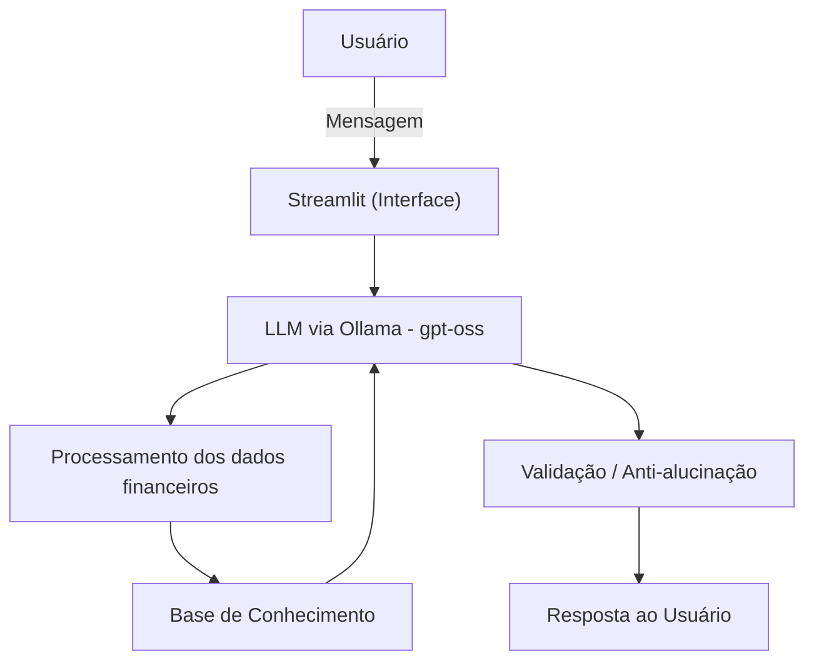

# 🤖 Fin — Agente Financeiro Inteligente com IA Generativa

Fin é um agente conversacional baseado em IA generativa que atua como **conselheiro e educador financeiro pessoal**. Ele analisa a situação financeira do usuário (renda, gastos, dívidas, perfil de investidor e histórico de atendimentos) e responde perguntas em linguagem natural, sempre com foco em educação financeira, clareza e segurança contra alucinações.

---

## 💡 Sobre o Projeto

### Problema

Muitas pessoas não possuem controle efetivo sobre suas finanças pessoais, o que dificulta visualizar como o dinheiro é gasto ao longo do mês. Isso leva ao endividamento, gastos além do orçamento e dificuldade para atingir metas financeiras — muitas vezes por falta de informações claras e orientação personalizada.

### Solução

O Fin analisa os dados financeiros do usuário, interpreta essas informações e gera insights personalizados. Ele responde dúvidas em linguagem natural, identifica oportunidades de economia, avalia a saúde financeira do usuário e sugere ações práticas — sempre em tom educativo, sem julgamentos e sem prometer resultados financeiros.

### Público-Alvo

Pessoas iniciantes em finanças pessoais que querem aprender a administrar melhor o dinheiro, controlar gastos, evitar dívidas e criar hábitos financeiros mais saudáveis.

---

## 🧠 Persona

| | |
|---|---|
| **Nome** | Fin |
| **Papel** | Conselheiro e educador financeiro virtual |
| **Personalidade** | Consultivo, didático, usa exemplos e analogias, nunca julga o usuário |
| **Tom** | Acessível, educativo e respeitoso — explica termos técnicos sempre que necessário |

> *"Olá! Eu sou o Fin, seu conselheiro e educador financeiro particular. Como posso ajudar com suas finanças hoje?"*

---

## 🏗️ Arquitetura



| Componente | Descrição |
|------------|-----------|
| **Interface** | Streamlit (chat interativo) |
| **LLM** | Ollama, modelo `gpt-oss` (execução local) |
| **Base de Conhecimento** | Arquivos CSV/JSON com dados do cliente (perfil, transações, produtos, histórico) |
| **Validação** | Regras no system prompt que restringem o agente aos dados fornecidos |

---

## 🔒 Segurança e Anti-Alucinação

- O agente responde exclusivamente com base nos dados fornecidos no contexto.
- Nunca inventa valores, históricos ou produtos financeiros.
- Quando não possui informação suficiente, admite e solicita mais dados.
- Deixa claro quando uma resposta é uma estimativa ou interpretação.
- Não recomenda compra/venda de ativos específicos nem garante rentabilidade.
- Não substitui aconselhamento financeiro profissional.
- Não incentiva práticas ilícitas (fraude, sonegação, etc.).
- Não compartilha dados de outros usuários.

---

## 📂 Base de Conhecimento

| Arquivo | Formato | Uso |
|---------|---------|-----|
| `data/perfil_investidor.json` | JSON | Perfil, objetivos e metas financeiras do cliente |
| `data/transacoes.csv` | CSV | Histórico de receitas e despesas |
| `data/historico_atendimento.csv` | CSV | Atendimentos anteriores, para dar continuidade ao acompanhamento |
| `data/produtos_financeiros.json` | JSON | Produtos financeiros disponíveis (risco, rentabilidade, liquidez, indicação) |

Os dados são carregados na inicialização da aplicação e montados dinamicamente no contexto enviado ao modelo a cada pergunta, junto com o system prompt fixo que define comportamento, regras e limitações.

---

## ⚙️ Como Executar

### Pré-requisitos

- [Python 3.9+](https://www.python.org/)
- [Ollama](https://ollama.ai/) instalado e rodando localmente
- Modelo `gpt-oss` baixado no Ollama:
  ```bash
  ollama pull gpt-oss
  ```

### Instalação

```bash
git clone https://github.com/lohan-ribeiro/agente-financeiro-inteligente-com-ia-generativa.git
cd agente-financeiro-inteligente-com-ia-generativa
pip install streamlit pandas requests
```

### Executando

1. Inicie o Ollama (garanta que está servindo em `http://localhost:11434`):
   ```bash
   ollama serve
   ```
2. Rode a aplicação:
   ```bash
   streamlit run app.py
   ```
3. Acesse `http://localhost:8501` e converse com o Fin.

> ⚠️ **Atenção:** confira a variável `OLLAMA_URL` em `app.py` — ela precisa apontar para a porta correta do Ollama (padrão `11434`).

---

## 💬 Exemplo de Interação

**Usuário:** "Recebo R$ 6.000 por mês e meus gastos com moradia, alimentação, transporte e lazer somam R$ 4.400. Tenho uma dívida de R$ 3.000 no cartão."

**Fin:**
```
Resumo da situação
Sua renda cobre seus gastos atuais, porém a dívida do cartão merece atenção.

Pontos positivos
• Sua renda é superior às despesas mensais.

Pontos de atenção
• A dívida do cartão pode gerar juros elevados caso não seja quitada rapidamente.

Recomendações
• Priorize o pagamento da dívida do cartão.
• Considere reduzir gastos com lazer temporariamente.

Próximos passos
Posso calcular sua saúde financeira e sugerir um plano de organização mensal.
```

---

## 📊 Avaliação

O agente é avaliado a partir de três métricas principais:

| Métrica | O que avalia |
|---------|--------------|
| **Assertividade** | Se a resposta corresponde ao que foi perguntado |
| **Segurança** | Se o agente evita inventar informações fora do contexto |
| **Coerência** | Se a resposta é compatível com o perfil do cliente |

Cenários de teste incluem: consulta de gastos, recomendação de produto, perguntas fora do escopo financeiro e perguntas sobre informações inexistentes na base.

---

## 📁 Estrutura do Repositório

```
📁 agente-financeiro-inteligente-com-ia-generativa/
│
├── 📄 README.md
├── 📄 app.py                          # Aplicação Streamlit + integração com Ollama
│
├── 📁 data/
│   ├── perfil_investidor.json
│   ├── transacoes.csv
│   ├── historico_atendimento.csv
│   └── produtos_financeiros.json
│
└── 📁 docs/
    ├── 01-documentacao-agente.md      # Caso de uso, persona e arquitetura
    ├── 02-base-conhecimento.md        # Estratégia de dados
    ├── 03-prompts.md                  # System prompt e exemplos de interação
    ├── 04-metricas.md                 # Avaliação e métricas
    └── 05-pitch.md                    # Roteiro e link do pitch
```

---

## 🛠️ Stack Utilizada

- **Interface:** [Streamlit](https://streamlit.io/)
- **LLM:** [Ollama](https://ollama.ai/) (`gpt-oss`, execução local)
- **Dados:** Python + Pandas (CSV/JSON)

---

## ⚠️ Limitações

- Não acessa nem compartilha dados bancários sensíveis reais.
- Não substitui um profissional de finanças qualificado.
- Não faz recomendações diretas de compra/venda de investimentos.
- Não prevê comportamento do mercado financeiro.


## ⚠️ Aviso
Todos os dados usados ​​neste projeto são fictícios e usados ​​apenas para fins educacionais.